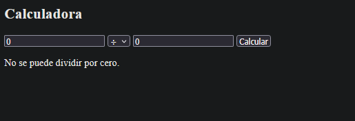
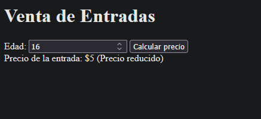
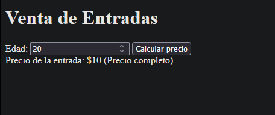
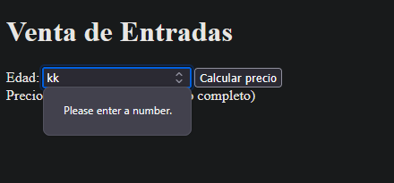
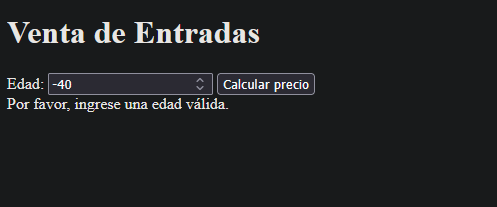
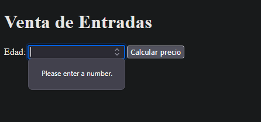

--FUNCIONAMIENTO DE LA CALCULADORA--

1ºSuma: 

2ºResta:

3ºMultiplicación: 

4ºDivisión:

5ºError al introducir letras u otros caracteres no numéricos: 

6ºDivisión por cero:

7ºCampos vacíos: 

--FUNCIONAMIENTO DE VENTA DE ENTRADAS--

1ºLa edad es menor de 12 años:

2ºLa edad entre 12 y 18 años:

3ºLa edad es mayor de 18 años:

4ºValores no numericos:

5ºEdad negativa o nula:

6ºCampos vacíos.

